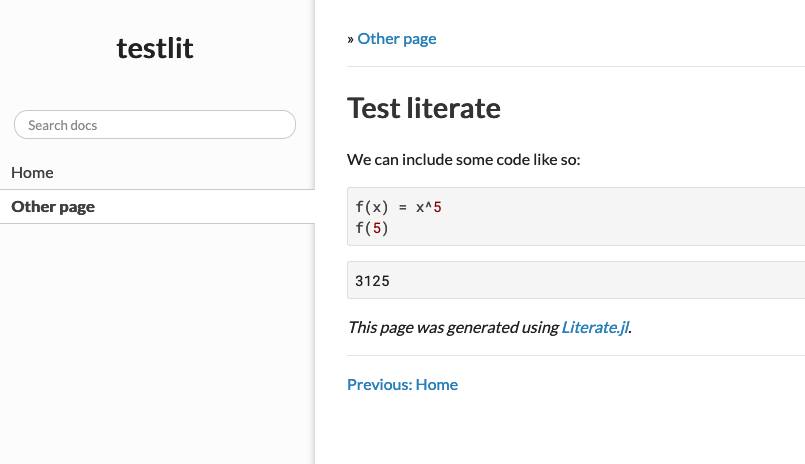
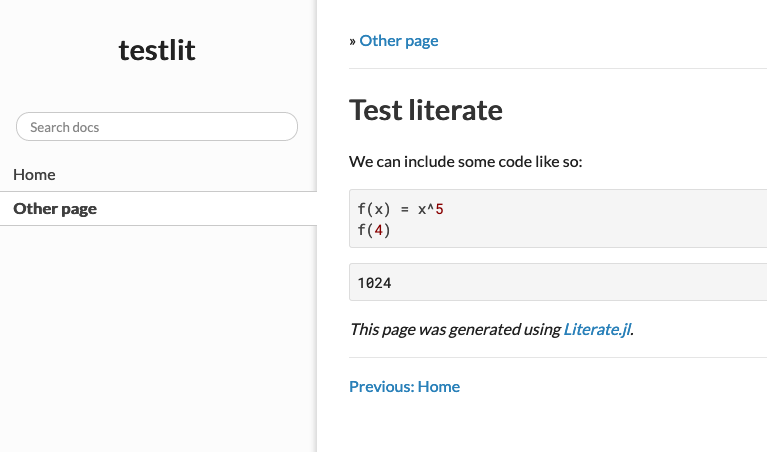

# LiveServer + Literate

(_Thanks to [Fredrik Ekre](https://github.com/fredrikekre) and [Benoit Pasquier](https://github.com/briochemc) for their input; a lot of this section is drawn from an early prototype suggested by Fredrik._)

You've likely already seen how LiveServer could be used along with Documenter to have live updating documentation (see [`servedocs`](/man/functionalities/#servedocs-1) if not).

It is also easy to use LiveServer with both Documenter and [Literate.jl](https://github.com/fredrikekre/Literate.jl), a package for literate programming written by Fredrik Ekre that can convert julia script files into markdown.
This can be particularly convenient for documentation pages with a lot of code examples.

Only two steps are required to have this working (assuming you have already added Literate to your environment):

1. pick a folder structure
1. modify the `docs/make.jl` file to contain a line calling Literate

### Folder structure

There are effectively two recommended ways, pick whichever one you prefer.
In the first case, the script files `.jl` to be compiled by Literate are at the _same location_ as the output file so that you would have:

```
docs
└── src
    ├── index.jl
    └── index.md
```

if you're happy with this, then you can jump to the [next step](#Modifying-the-make-file-1) to change the make file.

However you may not be happy with this, in particular if you have lots of such files and a mix of files which are generated by `Literate` and some which aren't, then typically you might prefer to keep all scripts in a separate folder.
You would just have to make sure that the output is properly redirected to `docs/src`.
Your folder structure would then look something like:

```
docs
├── lit
│   └── index.jl
└── src
    └── index.md
```

The only thing you have to do in this case is to specify to `servedocs` where the "literate folder" is; this is a keyword argument and for the example above we would have:

```julia
servedocs(literate=joinpath("docs", "lit"))
```

### Modifying the make file

The only thing you have to do here is add a few lines to specify which files should be compiled by `Literate`.
Assuming you have taken the second path in the situation above, your `make.jl` file should look like:

```julia
using Documenter, Literate

src = joinpath(@__DIR__, "src")
lit = joinpath(@__DIR__, "lit")

for (root, _, files) ∈ walkdir(lit), file ∈ files
    splitext(file)[2] == ".jl" || continue
    ipath = joinpath(root, file)
    opath = splitdir(replace(ipath, lit=>src))[1]
    Literate.markdown(ipath, opath)
end

makedocs(
    sitename = "Test",
    modules = [Test],
    pages = ["Home" => "index.md"]
    )
```

If you were happy with the `.jl` and `.md` files being in the same location, simply replace the `lit = ` line by

```julia
lit = src
```

What the for loop does is simple: it loops over the files in the folder where it's likely to encounter `.jl` files and for those it encounters:

1. it retrieves the path to the file (`ipath`)
1. it constructs the output path in `docs/src` (`opath`)
1. it compiles the file `ipath` and saves the output at `opath`

## Complete example

The function `LiveServer.servedocs_literate_example` generates a directory which has the right structure that you can copy for your package.
To experiment, do:

```julia-repl
julia> using LiveServer
julia> LiveServer.servedocs_literate_example("test_dir")
julia> cd("test_dir")
julia> servedocs(literate=joinpath("docs", "literate"))
```

if you then navigate to `localhost:8000` you should end up with



if you modify `test_dir/docs/literate/man/pg1.jl` for instance writing `f(4)` it will be applied directly:


